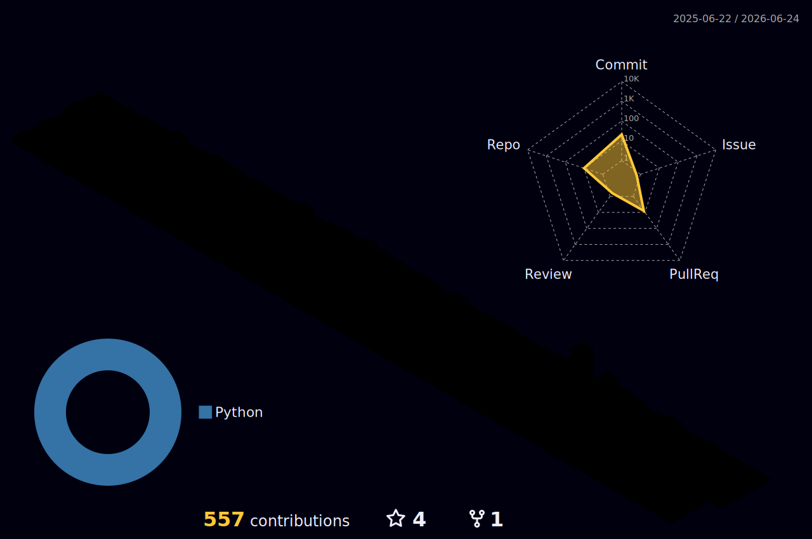
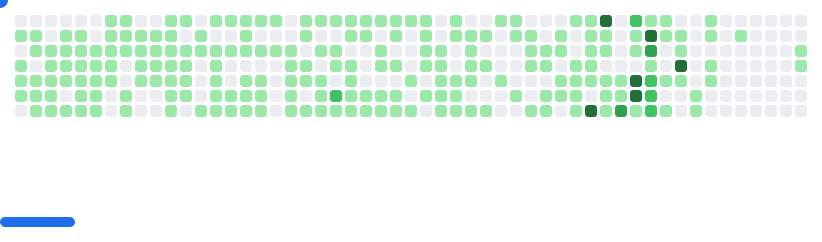

<!-- Profile README for Hemant Rajpal -->
<p align="center">
  
</p>

<p align="center">
  
</p>

<p align="center">
  <a href="https://www.linkedin.com/in/hemantrajpal9018/">
    
  </a>
  <a href="https://github.com/HemantRajpal-9018">
    
  </a>
  
</p>

<p align="center">
  
</p>

---


<!-- Snake -->
<p align="center">
  <picture>
    <source media="(prefers-color-scheme: dark)" srcset="assets/snake-dark.svg" />
    <source media="(prefers-color-scheme: light)" srcset="assets/snake.svg" />
    
  </picture>
</p>

<!-- 3D Contributions -->
<!-- 3D contributions -->
<p align="center">
  <!-- pick the exact filename that exists in your repo folder -->
  
</p>


<!-- Breakout game from contributions -->
<p align="center">
  <picture>
    <source media="(prefers-color-scheme: dark)" srcset="images/breakout-dark.svg" />
    <source media="(prefers-color-scheme: light)" srcset="images/breakout-light.svg" />
    
  </picture>
</p>


---

## 🔬 AI Researcher Agent – Reasoning Model Gap Analysis

A Python-based research agent that catalogues the latest reasoning-focused language models (as of March 2026) and systematically identifies gaps in their capabilities.

### ⚡ What Makes This Agent Different

> Most AI research tools just *list* models. This one **thinks forward**.

| Feature | Typical Tools | This Agent |
|---------|--------------|------------|
| Model catalogue | ✅ | ✅ 10 reasoning models with benchmarks, strengths & weaknesses |
| Gap analysis | ❌ | ✅ 15-category gap taxonomy with severity, evidence & research directions |
| **🔮 Trend forecasting** | ❌ | ✅ 8 emerging trends with confidence scores, time horizons & market implications |
| **💡 Innovation scoring** | ❌ | ✅ Multi-dimensional opportunity scoring (Impact × Feasibility × Novelty × Timing) |
| **🎯 Best-fit recommendations** | ❌ | ✅ Use-case-driven model recommendations (math, coding, multi-modal, self-hosted…) |
| **⚔️ Head-to-head comparisons** | ❌ | ✅ Benchmark deltas, weakness diffs & plain-English verdicts |
| **⚡ Research velocity** | ❌ | ✅ Provider iteration speed, release cadence, momentum signals |
| **🛡️ Risk assessment** | ❌ | ✅ Vendor lock-in, deprecation risk, API stability & mitigation notes |
| **🗺️ Competitive landscape** | ❌ | ✅ Market segment mapping, overlap analysis & underserved opportunities |
| **🗓️ Research roadmap** | ❌ | ✅ Phased milestones with deliverables, success metrics & timelines |
| **🧪 Autoresearch integration** | ❌ | ✅ Generates experiment programs for karpathy/autoresearch (GPU-powered autonomous experiments) |
| **🖥️ Sandbox config inspector** | ❌ | ✅ Detects CPU, RAM, GPU, CUDA, installed tools & autoresearch compatibility |
| **Comprehensive reports** | ❌ | ✅ `--full` mode combines all modules into one actionable report |
| **233 regression tests** | ❌ | ✅ Full cross-module regression suite guarding every invariant |

### Quick Start

```bash
pip install -r requirements.txt

# Gap analysis
python -m ai_researcher                             # plain-text
python -m ai_researcher --format md                 # Markdown
python -m ai_researcher --format md -o report.md    # save to file

# Full comprehensive report (all modules)
python -m ai_researcher --full
python -m ai_researcher --full --format md -o full_report.md

# Trend forecast
python -m ai_researcher --trends

# Innovation opportunity scores
python -m ai_researcher --opportunities

# Head-to-head model comparison
python -m ai_researcher --compare "OpenAI o3" "DeepSeek R1"

# Best-fit model recommendations
python -m ai_researcher --recommend

# Research velocity analysis (v3)
python -m ai_researcher --velocity

# Risk assessment matrix (v3)
python -m ai_researcher --risks

# Competitive landscape map (v3)
python -m ai_researcher --landscape

# Prioritized research roadmap (v3)
python -m ai_researcher --roadmap

# Generate autoresearch experiment program (v3.1)
python -m ai_researcher --autoresearch-program               # plain-text
python -m ai_researcher --autoresearch-program --format md    # program.md for autoresearch
python -m ai_researcher --autoresearch-program --format md -o program.md  # save directly

# Sandbox environment config (v3.2)
python -m ai_researcher --sandbox-config                     # plain-text
python -m ai_researcher --sandbox-config --format md         # Markdown
python -m ai_researcher --sandbox-config --format md -o sandbox.md  # save to file

# List all tracked models
python -m ai_researcher --list-models
```

### Models Tracked

OpenAI o3 · OpenAI o3-mini · OpenAI o1 · DeepSeek R1 · Gemini 2.5 Pro · Gemini 2.0 Flash Thinking · Claude 3.7 Sonnet · QwQ-32B · Grok 3 · Phi-4-reasoning

### Gap Categories Analysed

Faithfulness · Hallucination · Self-correction · Spatial reasoning · Temporal reasoning · Common sense · Mathematical proof · Adversarial robustness · Calibration · Efficiency · Multi-modal reasoning · Long-horizon planning · Abstraction · Compositionality · Tool-use reasoning

### 🔮 Trend Forecasts Tracked

Adaptive Compute Allocation · Formal Reasoning Verification · Native Multi-Modal CoT · Reasoning Distillation · RL as Training Signal · Agentic Reasoning · Open-Source Parity · Safety Alignment for Reasoning

### Running Tests

```bash
pip install pytest
python -m pytest tests/ -v    # 233 tests across 5 test files
```

### 🧪 Autoresearch Integration (karpathy/autoresearch)

This agent can generate experiment program files (`program.md`) for use with
[karpathy/autoresearch](https://github.com/karpathy/autoresearch) — an autonomous
LLM training experiment runner.

**How the integration works:**

```
Our agent (gap analysis + opportunity scoring)
    → autoresearch_adapter
        → program.md (13 prioritized experiments)
            → karpathy/autoresearch runs them on GPU
```

Our agent identifies **what to research** (gaps, priorities); autoresearch **runs the experiments** (trains models, measures improvements).

```bash
# Generate a program.md file
python -m ai_researcher --autoresearch-program --format md -o program.md

# Then in your autoresearch clone:
cp program.md /path/to/autoresearch/program.md
# Point your AI agent at program.md and let it run overnight
```

> **⚠️ GPU Required:** Running autoresearch experiments requires an NVIDIA GPU
> (tested on H100). This adapter only *generates* the program file. See the
> [autoresearch repo](https://github.com/karpathy/autoresearch) for hardware
> setup instructions.

### 📋 External Tool Assessment

| Tool | Relevant? | Why / Why Not |
|------|-----------|---------------|
| [karpathy/autoresearch](https://github.com/karpathy/autoresearch) | ✅ Yes | Autonomous LLM experiment runner — complements our gap analysis by actually running experiments. **Integrated as `--autoresearch-program`.** |
| [oddlama/autokernel](https://github.com/oddlama/autokernel) | ❌ No | Linux kernel `.config` file manager (Rust/Lua). Manages kernel build configuration, not related to AI/ML research despite the "auto" prefix. |

### 🖥️ Sandbox Environment Configuration

Check what hardware and software is available in your environment:

```bash
python -m ai_researcher --sandbox-config
```

This detects:
- **CPU** — model, cores, threads, architecture
- **Memory** — total and available RAM
- **Disk** — total and free space
- **GPU** — NVIDIA/AMD detection, CUDA availability, VRAM
- **OS** — distribution, kernel version, hypervisor
- **Tools** — Python, pip, git, node, go, docker, nvidia-smi, uv
- **Autoresearch compatibility** — whether karpathy/autoresearch can run here, with specific blockers listed

**Current sandbox** (GitHub Actions runner):

| Resource | Specification |
|----------|--------------|
| CPU | AMD EPYC 7763, 4 vCPUs |
| RAM | 16 GB |
| Disk | 145 GB (91 GB free) |
| GPU | ❌ None (no NVIDIA, no CUDA) |
| OS | Ubuntu 24.04 LTS |
| Hypervisor | Microsoft Azure |
| Python | 3.12.3 |

> **⚠️ GPU Status:** This sandbox does **not** have a GPU. The agent can generate
> autoresearch experiment programs (`--autoresearch-program`), but you need to run
> them on a machine with an NVIDIA GPU (H100 recommended). The `--sandbox-config`
> command will tell you exactly what's missing.

---

<p align="center">
  
  
</p>

<!-- Alternative banners you can switch to -->
<!-- Replace the first  with one of these: banner-matrix.svg or banner-glitch.svg -->
