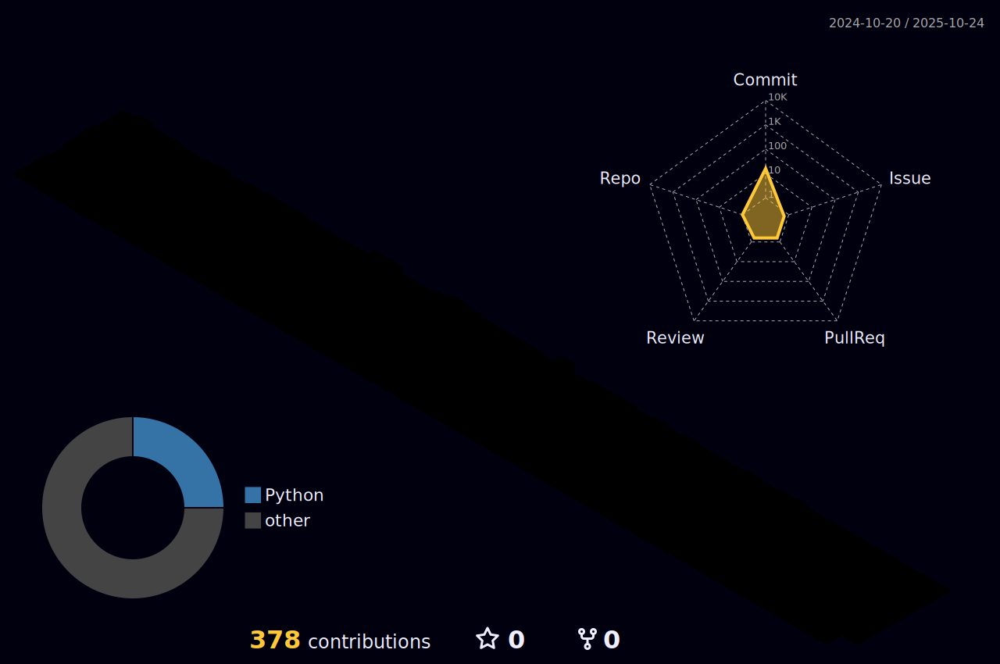
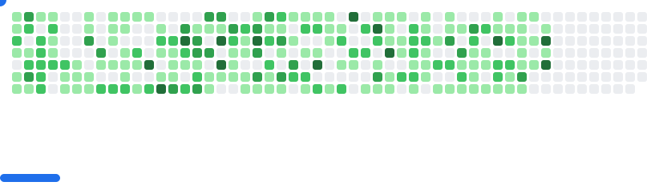

<!-- Profile README for Hemant Rajpal -->

  

  

  
  
  

  

---

### Animated widgets (SVGs that render in README)
These will appear after the included GitHub Actions run once.

<!-- Snake -->

  <picture>
    <source media="(prefers-color-scheme: dark)" srcset="assets/snake-dark.svg" />
    <source media="(prefers-color-scheme: light)" srcset="assets/snake.svg" />
    
  </picture>

<!-- 3D Contributions -->

  

<!-- Breakout game from contributions -->

  <picture>
    <source media="(prefers-color-scheme: dark)" srcset="images/breakout-dark.svg" />
    <source media="(prefers-color-scheme: light)" srcset="images/breakout-light.svg" />
    
  </picture>

---

  
  

<!-- Alternative banners you can switch to -->
<!-- Replace the first  with one of these: banner-matrix.svg or banner-glitch.svg -->
